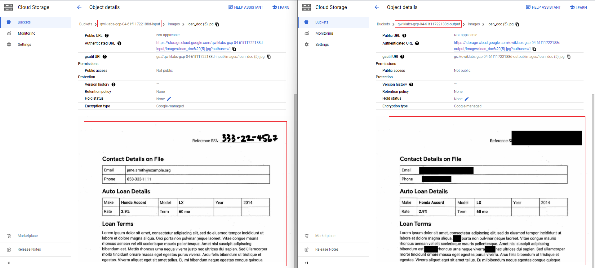

# Overview of Google DLP Service
Data Loss Prevention is a service as part of Google Cloud security catalog that helps you find, classify, and protect sensitive data.

**During performance, I employed the service to safeguard data in diverse formats,**

| Data Format      | Before DLP                                           |    After DLP                                                |
|-------------     |-------------------------------------------------     |----------------------------------------------------         |
|    Image         |   [Loan Doc](https://raw.githubusercontent.com/yaya2devops/gdlp/main/before/images/loan_doc(1).jpg)         | [Loan Doc](https://raw.githubusercontent.com/yaya2devops/gdlp/main/after/images/loan_doc(1).jpg)                   |
|    CSV   |  [Chat Log](before/csv/SampleChatLogData(1).csv)    |      [Chat Log](after/csv/SampleChatLogData(1).csv)   |
|    Plain Text           |       [Visit Log](before/logs/visit-log(1).txt)                                          |        [Visit Log](after/logs/visit-log(1).txt)        

I did redacted an *Invented* Patient Intake Form - [Before](https://raw.githubusercontent.com/yaya2devops/gdlp/main/case/before/images/patient-intake-form.PNG) - and - [After](https://raw.githubusercontent.com/yaya2devops/gdlp/main/case/after/images/patient-intake-form.PNG).

*Previously*, I also applied a package and an API to [fulfill my DLP needs](https://github.com/yaya2devops/dlp-api).

### Attention

There is still much to uncover regarding the redacted assets in this project.  
I encourage you to explore the folders and investigate [further](case/README.md).
